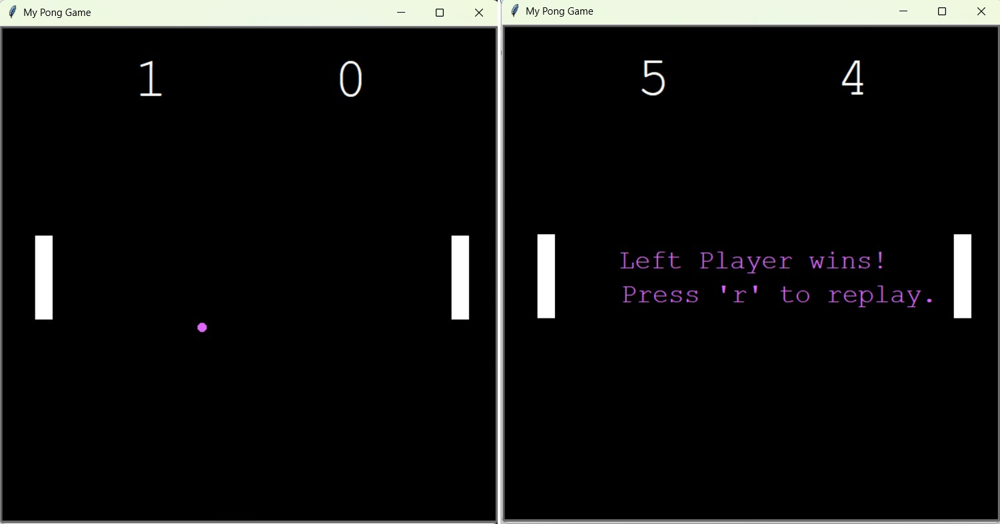

# |  °     | Python Pong Game

A classic Pong game built entirely in Python using the `turtle` graphics library.

## 🎮 Features
- 2-player game (up/down and w/s keys)
- Snake grows when eating food
- Game Over when ball is hitting left or right walls
- Replay with key **R**
- Scoreboard display

## 🎮 Technologies and Techniques
- Python 3.10+
- Object Oriented Programming
- Turtle Graphics

## 🧰 Requirements
- Python 3.10+
- (Optional) PyCharm or VSCode

## 🖼️ Preview


## ▶️ Run the Game

```bash
   python main.py